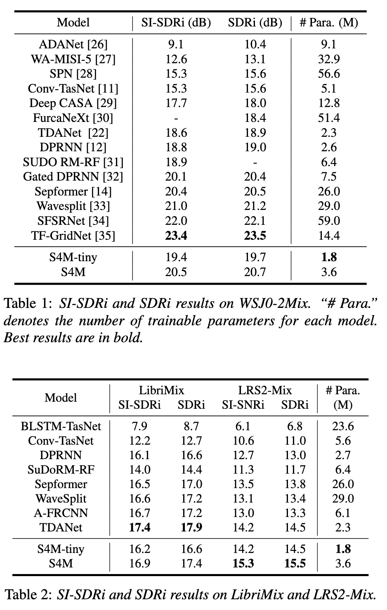

# S4M: Efficient Speech Separation Framework Based on Neural State-Space Models

#### Chen Chen, Chao-Han Huck Yang, Kai Li, Yuchen Hu, Pin-Jui Ku, Eng Siong Chng | Nanyang Technological University, Georgia Institute of Technology, Tsinghua University

PyTorch Implementation of [S4M (Interspeech 2023)](https://arxiv.org/pdf/2305.16932.pdf): Efficient Speech Separation Framework Based on Neural State-Space Models.

[](https://arxiv.org/pdf/2305.16932.pdf) [](https://github.com/JusperLee/CTCNet) 


S4M is an innovative speech separation framework built on neural state-space models (SSM). By utilizing linear time-invariant systems for sequence modeling, we efficiently model input signals using linear ordinary differential equations (ODEs) for outstanding representation learning.

## Features

- **SSM-Based Representation**: Efficient modeling of input signals using state-space techniques.
- **Multi-Scale Decomposition**: Decompose input mixtures into varied resolutions, providing a holistic approach to learning both separation and reconstruction.
- **Optimized Model Complexity**: Achieves top-tier performance metrics with reduced complexity and fewer trainable parameters.

## Performance

- Comparable SI-SDRi metrics against leading separation backbones.
- The `S4M-tiny` model, with only 1.8M parameters, surpasses the attention-based Sepformer (26.0M parameters) in noisy conditions using only 9.2% of MACs.

## Quick Start

```bash
git clone https://github.com/JusperLee/S4M.git
cd S4M
python S4M.py
# Follow installation and usage instructions
```

## Results & Benchmarks



## Acknowledgements

This code is provided by Chen Chen. 

- [S4 code](https://github.com/HazyResearch/state-spaces) [Apache-2.0 license]
- [SuDoRM-RF code](https://github.com/etzinis/sudo_rm_rf) [MIT license]
- [TDANet code](https://github.com/JusperLee/TDANet) [Apache-2.0 license]

## License

This project is licensed under the MIT License - see the [LICENSE](LICENSE) file for details.


## Citations ##
If you find this code useful in your research, please cite our work:
```bib
@inproceedings{chen23g_interspeech,
  author={Chen Chen and Chao-Han Huck Yang and Kai Li and Yuchen Hu and Pin-Jui Ku and Eng Siong Chng},
  title={{A Neural State-Space Modeling Approach to Efficient Speech Separation}},
  year=2023,
  booktitle={Proc. INTERSPEECH 2023},
  pages={3784--3788},
  doi={10.21437/Interspeech.2023-696}
}
```